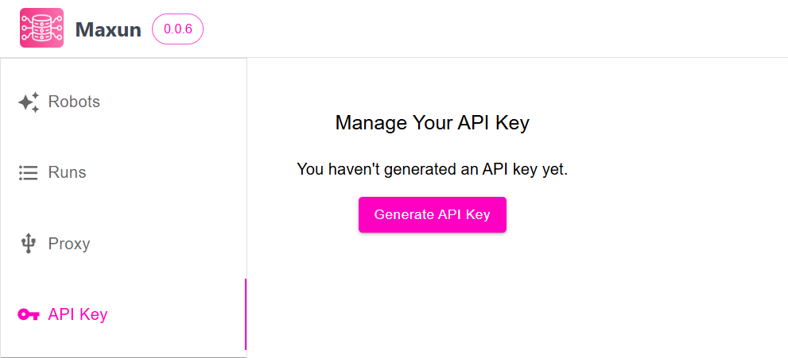

Maxun lets you get the data your robot extracted and run robots via API. 

### 1. Generate API Key
You can find your API key in the "API Key" section on Maxun Dashboard.

|||
|:---:|:---:|
|Generate API Key|API Key Generated|

### 2. Authorize 
1. Go to "Website To API" tab on the dashboard's sidebar.
2. Copy the Maxun API Key generated from step 1 and input it by clicking Authorize.

### 3. Try Out 
After successful authorization, the user can proceed to try out the API endpoint. By clicking on the **Try it out** button present within each route. Depending on the route, it might require paramters for execution.

The routes to execute a robot run via an API call or to get information about the robot can be further segregated into two types:

1. [Robot Routes](./robots.md)

2. [Run Routes](./runs.md)

