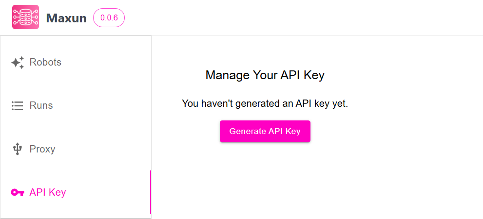
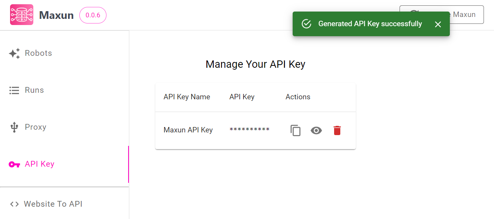
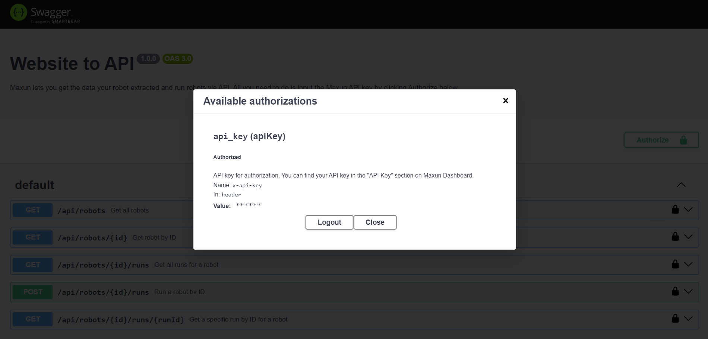
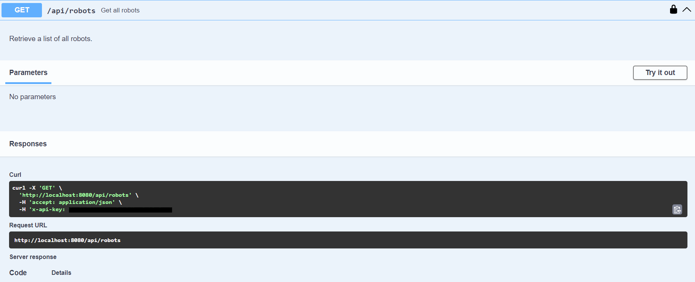

# API Key & Authentication

Maxun lets you get the data your robot extracted and run robots via API. Every request is authenticated with your Maxun API key.

## Base URL and Authentication

| | Maxun Cloud | Self-hosted |
|---|---|---|
| Base URL | `https://app.maxun.dev` | Your `BACKEND_URL` (default `http://localhost:8080`) |
| Auth header | `x-api-key: <your-api-key>` | `x-api-key: <your-api-key>` |

All REST endpoints live under `/api`. For example, to list your robots:

```bash
curl https://app.maxun.dev/api/robots \
  -H "x-api-key: YOUR_API_KEY"
```

A request without a key returns `401 API key is missing`, and an invalid key returns `403 Invalid API key`.

Available endpoints:

1. [Robot API](./robots.md): list, get and duplicate robots
2. [Run API](./runs.md): run robots and fetch their results
3. [Webhooks](./webhooks.md): receive results the moment a run finishes

## 1. Generate API Key
You can find your API key in the "API Key" section on Maxun Dashboard.

|
:---:|
|Generate API Key|

|
:---:|
|API Key Generated|

## 2. Authorize
1. Go to "API Key" tab on the dashboard's sidebar and select the option "test your API".
2. Click `Authorize`, paste the API Key you copied in step 1 and click `Authorize` to save.


## 3. Live Test
Click on the **Try it out** button present within each endpoint to get the output. To execute certain endpoints, you may need to provide specific parameters.



## Where Else the API Key Is Used

The same key works across every Maxun interface:

- **SDK:** set `MAXUN_API_KEY` or pass `apiKey` / `api_key`. See [Node.js SDK](/sdk/node-sdk/sdk-overview) and [Python SDK](/sdk/python-sdk/sdk-overview).
- **CLI:** `maxun login --api-key <your-api-key>`. See [CLI](/cli/cli-overview).
- **MCP:** send it as the `x-api-key` header. See [MCP Setup](/mcp/setup).
- **Chrome extension:** connect it to [extract data behind login](/extract-login).
