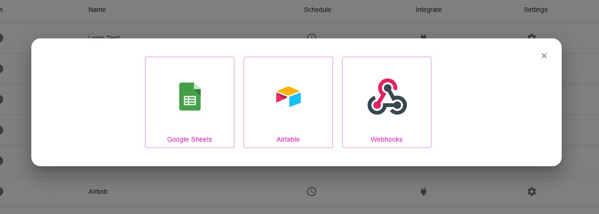
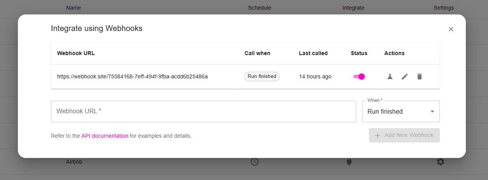

You can find the webhook integration option in the integration settings for each robot.





### 1. Event: Run finished
- Trigger: When a robot run finishes successfully. 

#### Payload Schema

| Field             | Type   | Description                                        |
|------------------|--------|----------------------------------------------------|
| event_type     | string | Type of event            |
| timestamp      | string | ISO timestamp when the webhook was triggered       |
| webhook_id     | string | Unique ID for this webhook                         |
| robot_id  | string | Unique identifier for the robot                    |
| run_id    | string | Unique identifier for the run                      |
| robot_name| string | Name of the robot                                  |
| status    | string | "success" or "failed"                          |
| started_at| string | ISO timestamp when the run started                 |
| finished_at| string| ISO timestamp when the run ended                   |
| extracted_data | object | Present only when run is successful         |
| error     | object | Present only when run fails                        |
| metadata  | object | Metadata like browser ID and user ID               |

---

#### Example: Successful Run

```
{
  "event_type": "run_completed",
  "timestamp": "2025-05-29T15:53:15.595Z",
  "webhook_id": "1b480cbd-c43b-4541-a69e-92d82000d992",
  "data": {
    "robot_id": "d453def3-800a-4b6c-ba31-854cf8dd8d26",
    "run_id": "110c4dae-c39b-4b30-a932-eff1022e4bb0",
    "robot_name": "Test Robot",
    "status": "test",
    "started_at": "2025-05-29T15:52:30.595Z",
    "finished_at": "2025-05-29T15:53:15.595Z",
    "extracted_data": {
      "captured_texts": [
        {
          "Product Name": "MacBook Pro 16-inch M3 Max",
          "Price": "$3,999.00",
          "Rating": "4.8/5 stars",
        }
      ],
      "captured_lists": {
        "list_1": [
          {
            "Rank": "1",
            "Product": "MacBook Air M2",
            "Category": "Laptops",
            "Units Sold": "2,847",
            "Revenue": "$2,847,000"
          }
        ],
        "list_0": [
          {
            "Customer": "Sarah M.",
            "Rating": "5 stars",
            "Review": "Absolutely love my new MacBook! The battery life is incredible and the performance is outstanding.",
            "Date": "2024-12-15",
            "Verified Purchase": "Yes"
          }
        ]
      },
      "total_rows": 5,
      "captured_texts_count": 3,
      "captured_lists_count": 2,
      "screenshots_count": 5
    },
    "metadata": {
      "browser_id": "d27ace57-75cb-441c-8589-8ba34e52f7d1",
      "user_id": 108
    }
  }
}
```

### 2. Event: Run failed
- Trigger: When a robot run fails. 

#### Payload Schema

| Field        | Type     | Description                                            |
| ------------ | -------- | ------------------------------------------------------ |
| event_type     | string | Type of event            |
| timestamp      | string | ISO timestamp when the webhook was triggered       |
| webhook_id     | string | Unique ID for this webhook                         |
| robotId    | string        | Unique identifier for the robot                        |
| runId      | string        | Unique identifier for the run                          |
| robotName  | string        | Name of the robot                                      |
| status     | string        | Status of the run                  |
| message | string        | Description of the error                               |
| type    | string        | Type/category of error                                 |
| stack   | string      | Stack trace of the error                               |
| metadata   | object      | Optional metadata like browserId, userId, etc.     |


#### Example: Failed Run

```
{
  "event_type": "run_failed",
  "timestamp": "2025-05-29T15:53:15.595Z",
  "webhook_id": "1b480cbd-c43b-4541-a69e-92d82000d992",
  "data": {
    "robotId": "d453def3-800a-4b6c-ba31-854cf8dd8d26",
    "runId": "110c4dae-c39b-4b30-a932-eff1022e4bb0",
    "robotName": "Test Robot",
    "status": "failed",
    "error": {
      "message": "Timeout exceeded while waiting for element",
      "type": "TimeoutError",
      "stack": "TimeoutError: ...\n    at async Page.waitForSelector..."
    },
    "metadata": {
      "browserId": "d27ace57-75cb-441c-8589-8ba34e52f7d1",
      "userId": 108
    }
  }
}
```


