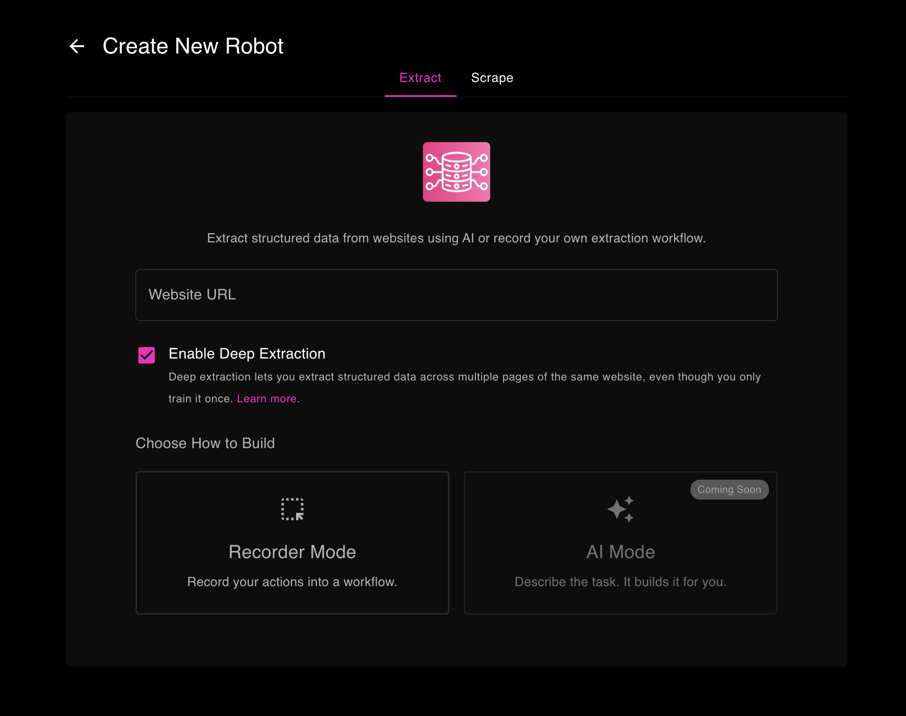

# Deep Extraction

> **Note:** Deep Extraction is available exclusively in **Maxun Cloud** and is currently in Beta. This feature is not available in self-hosted installations.

## What is Deep Extraction?

Deep Extraction lets you capture detailed information from multiple pages automatically. Here's what it does:

**Without Deep Extraction:**
- You visit a list page (like product listings)
- You extract data from that page only
- You manually visit each product to get more details

**With Deep Extraction:**
- You capture a list of items (like products)
- You click on one item and capture data from its detail page
- The robot does the same for all other items in the list

## How to Use Deep Extraction

### Step 1: Enable Deep Extraction Before Recording

When creating a new robot:
1. Enter your website URL
2. **Check the "Enable Deep Extraction" checkbox** (this is important!)
3. Choose "Recorder Mode"
4. Click "Start Recording"

> **Important:** You must enable this checkbox before starting your recording. You can't add deep extraction to an existing robot.

### Step 2: Record Your Workflow

Once the recording starts, perform these actions **in order**:

1. **Capture the list**
   - Use "Capture List" to select all items (products, companies, jobs, etc.)
   - Choose what fields you want from each list item

2. **Click on one item**
   - Click on any one item from the list to go to its detail page
   - This shows the robot the pattern to follow

3. **Capture detail page data**
   - Use "Capture Text" or "Capture List" to extract information from the detail page
   - Select all the fields you need

4. **Save your robot**

That's it! When you run this robot, it will:
- Capture all items from the list
- Visit each item's detail page
- Get the detailed information you specified

### Step 3: Run Your Robot

When you run the robot:
- It follows your recorded workflow
- Visits the list page
- Extracts data from the list
- Automatically visits each detail page
- Collects all the information you configured

## When Should You Use Deep Extraction?

Deep Extraction is perfect for:

### E-Commerce Websites
Extract product details from shopping sites:
- **List page**: Product names and prices
- **Detail pages**: Full descriptions, specs, reviews, stock status

### Business Directories
Get complete company information:
- **Directory page**: Company names and locations
- **Company pages**: Full contact details, services, team info

### Job Boards
Capture job listings with all details:
- **Listings page**: Job titles and companies
- **Job pages**: Full descriptions, requirements, salary, how to apply

### Any Multi-Page Data
Whenever you need information that's split across:
- A main list/search/directory page
- Individual detail pages for each item

## What You Need to Know

### Same Website Only
All pages must be on the same website. For example:
- ✅ `example.com/products` → `example.com/products/item-1`
- ❌ `example.com/products` → `different-site.com/details`

### Same Page Structure
All detail pages should look similar:
- Same layout
- Same type of information
- Same element positions

### Works With Pagination
If your list has multiple pages:
- Set up pagination as you normally would
- Deep extraction will process items from all pages

## Example: Extracting Product Information

Let's say you want to extract products from an online store:

### What You Record:
1. ✅ Enable Deep Extraction checkbox
2. Visit `shop.example.com/products`
3. Capture List: Product names and prices
4. Click on one product (e.g., "Blue Widget")
5. On the detail page, capture: Full description, specifications, reviews
6. Save robot

### What Happens When You Run It:
1. Robot goes to the products page
2. Captures all 50 product names and prices
3. Visits each product's detail page:
   - Blue Widget page
   - Red Gadget page
   - Green Tool page
   - ... and 47 more
4. Gets description, specs, and reviews from each
5. Returns everything in one file

<!-- ## Demo Tutorial
<iframe width="560" height="315" src="https://www.youtube.com/embed/Atr8V5hgiZQ?si=1Qvh0hlLyz3gpZgf" title="Maxun Deep Extract" frameborder="0" allow="accelerometer; autoplay; clipboard-write; encrypted-media; gyroscope; picture-in-picture; web-share" referrerpolicy="strict-origin-when-cross-origin" allowfullscreen></iframe> -->
