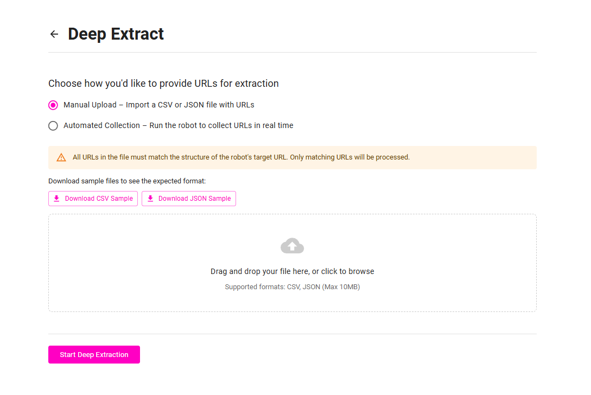
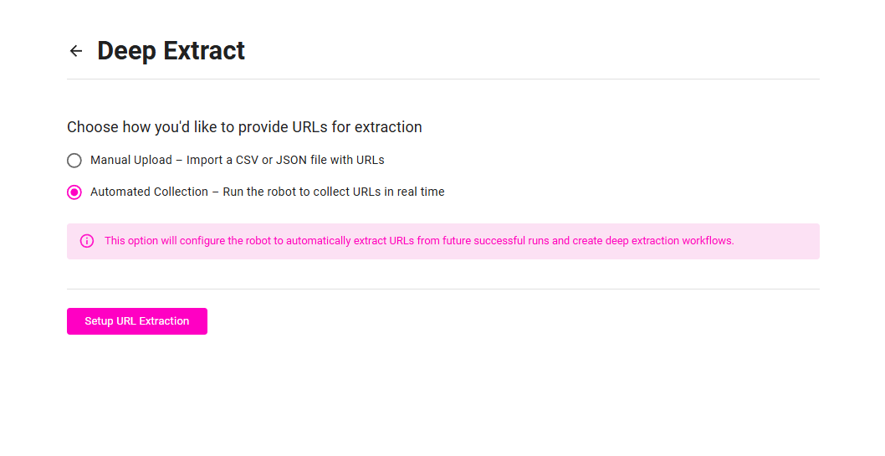

# Deep Extraction

> **Note:** Deep Extraction is available exclusively in **Maxun Cloud** and is currently in Beta. This feature is not available in self-hosted installations.

## Overview

Deep Extraction allows your robot to process multiple URLs using the same workflow, extracting data from many pages automatically. Instead of running on just one page, your robot can now handle hundreds or thousands of URLs with identical page structures.

## Requirements

**Same Domain Only**: All URLs must be from the same domain as your original robot. For example, if your robot is trained on `https://example.com/product/1`, all Deep Extraction URLs must also be from `example.com`.

**Identical Page Structure**: All URLs must have the same page layout and structure. If your robot extracts product titles and prices, every URL in your list must have these same elements in the same locations.

## How It Works

### Robot Modes

**Normal Mode**: Processes one URL at a time (default behavior)

**Bulk Mode**: Processes multiple URLs automatically using your configured URL list

You can switch between modes anytime. Switching to Bulk Mode enables Deep Extraction, while Normal Mode returns to standard single-URL operation.

### URL Sources

You can provide URLs in two ways:

**1. Manual Upload**: Upload a CSV or JSON file containing all the URLs you want to process.

**2. Extract from Run Data**: Your robot automatically discovers and processes URLs found during regular runs.

## Setup

### Manual Upload Method

**Supported Formats:**
- CSV files (.csv)
- JSON files (.json)

**CSV Example:**
```csv
url
https://example.com/product/1
https://example.com/product/2
https://example.com/product/3
```

**JSON Example:**
```json
{
  "urls": [
    "https://example.com/product/1", 
    "https://example.com/product/2",
    "https://example.com/product/3"
  ]
}
```

The upload interface supports drag and drop, validates URLs in real-time, and provides sample file templates for download.



### Automated Collection Method

With this method, your robot runs normally and automatically captures URLs encountered during execution. These discovered URLs are then queued for bulk processing in future runs.

> **Note:** In this mode, the robot needs to be executed at least once in order to collect and store the URLs required for deep extraction.



## Configuration

### Enabling Deep Extraction

1. Select "Deep Extract" icon for the preferred robot
2. Choose your URL source method (Manual Upload or Automated Collection)
3. Upload your URL file or set up automated collection
4. Click "Start Deep Extraction" or "Setup URL Extraction"

### Mode Management

Once configured, you can:
- **Switch to Bulk Mode**: Enables processing of multiple URLs
- **Switch to Normal Mode**: Returns to single URL processing  
- **Remove Deep Extraction**: Permanently removes all settings and returns robot to standard operation

## Demo Tutorial
<iframe width="560" height="315" src="https://www.youtube.com/embed/Atr8V5hgiZQ?si=1Qvh0hlLyz3gpZgf" title="Maxun Deep Extract" frameborder="0" allow="accelerometer; autoplay; clipboard-write; encrypted-media; gyroscope; picture-in-picture; web-share" referrerpolicy="strict-origin-when-cross-origin" allowfullscreen></iframe>
