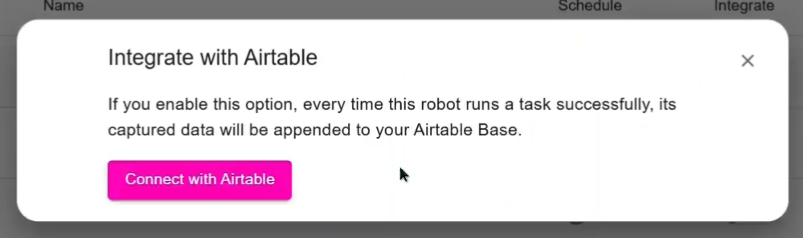
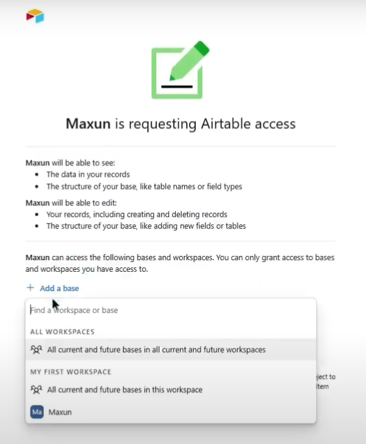
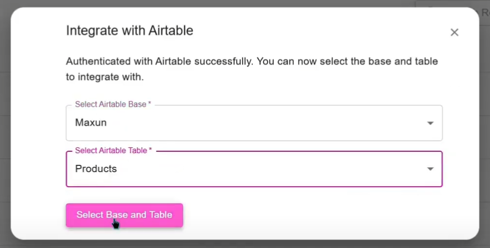

# Airtable

## Overview

Airtable integration allows you to automatically sync the data extracted by your robot directly into an Airtable Base. Whenever the robot completes a successful run, the captured data is appended to your designated Airtable Base, enabling seamless and real-time data management.

## Key Features

1. Automatic Data Syncing: Every successful robot run appends the captured data directly to your Airtable base.
2. Effortless Data Management: Keep all your extracted data organized in a single Airtable base for easy access and sharing.
3. Real-Time Updates: As soon as a run is complete, the data appears in your Airtable base.

## Important Note

The data extracted before integrating with Airtable will not be synced in the Airtable Base. Only the data extracted after the integration will be synced.

## Setting Up Airtable Integration

### Maxun Cloud
#### 1. Authenticate with Airtable
Simply authenticate using your Airtable account. Maxun Cloud handles the secure OAuth flow automatically.

#### 2. Select Airtable Base & Table
1. On successful Airtable authentication, you can grant access to the Airtable Base the robot should append data to.

2. After selecting the Airtable base, the robot will automatically append data to it after each successful run. If needed, the user can remove the integration at any time.

### Maxun Open Source

#### 1. Bring Your Own Airtable Client ID
Obtain Airtable Client Id by setting up a project in the [Airtable OAuth Integrations Platform](https://airtable.com/create/oauth).

#### 2. Authenticate With Airtable
Set up the OAuth Keys in the `.env` file and authenticate the robot with airtable **using the same account that was used to create the Client ID**.

#### 3. Select Airtable Base & Table
1. On successful Airtable authentication, you can grant access to the Airtable Base the robot should append data to.

2. After selecting the Airtable base, the robot will automatically append data to it after each successful run. If needed, the user can remove the integration at any time.

## Demo Tutorial
<iframe width="560" height="315" src="https://www.youtube.com/embed/Yf4Ifi2WuJk?si=9ITe3V3zQePoQDT7" title="YouTube video player" frameborder="0" allow="accelerometer; autoplay; clipboard-write; encrypted-media; gyroscope; picture-in-picture; web-share" referrerpolicy="strict-origin-when-cross-origin" allowfullscreen></iframe>