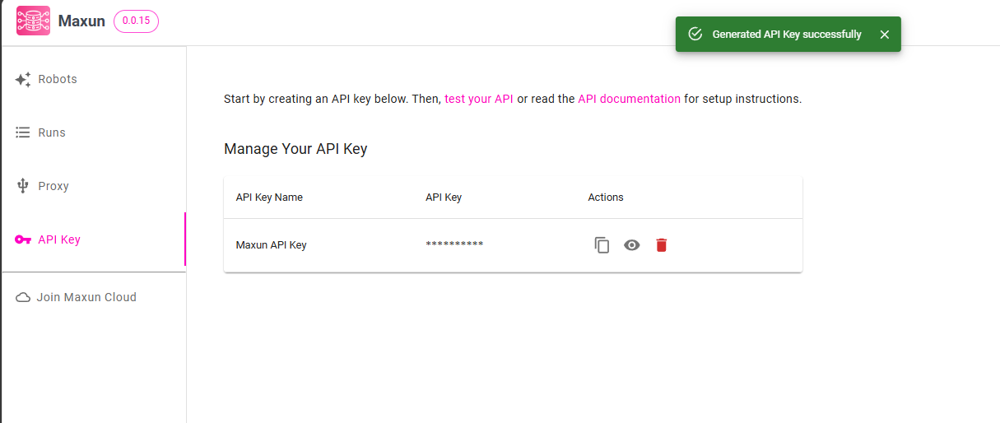
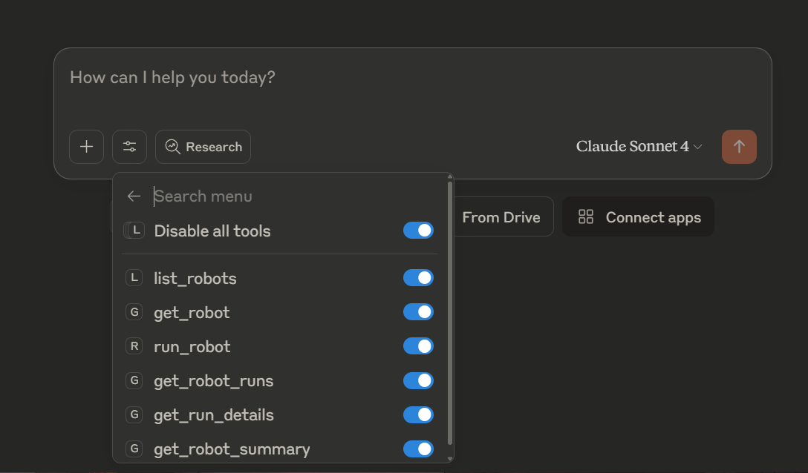

# Setup

This guide will help you setup the MCP server to connect Maxun to your local LLMs. In this guide, we will be taking an example of configuring the MCP server for Claude Desktop.

## Prerequisites

- Any local LLM with MCP support

## Steps

### 1. Build the MCP worker
Execute the below command to build the MCP server.

```
npm run mcp:build
```

This will generate a `dist` folder in your root directory with the `mcp-worker.js` file.

### 2. Generate API Key
Generate the API Key. You can find your API key in the "API Key" section on Maxun Dashboard.

|
:---:|
|Generate API Key|

|
:---:|
|API Key Generated|

### 3. Configure the MCP Server JSON file
Make sure your server is up and running. Configure your build MCP server path, API key and backend url.

- Navigate to claude desktop
- Go to File -> Settings -> Developer -> Edit Config
- Enter the below configuration for the json file 

```
{
  "mcpServers": {
    "maxun": {
      "command": "node",
      "args": [
        "/path/to/your/project/dist/mcp-worker.js"
      ],
      "env": {
        "MCP_API_KEY": "your_api_key_here",
        "BACKEND_URL": "your_backend_url_here",
        "MCP_WORKER": "true"
      }
    }
  }
}
```

After following the steps restart the claude desktop application. You'll be able to access all the tools provided by the MCP server on successful configuration.




