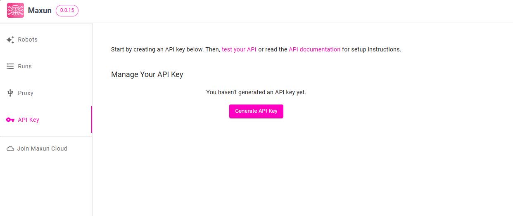
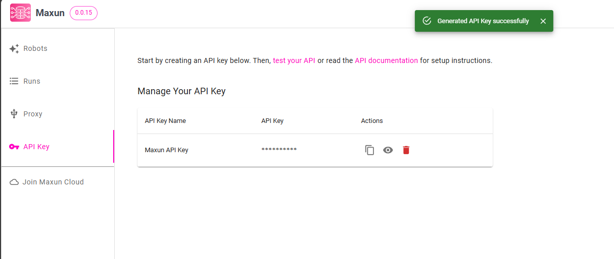
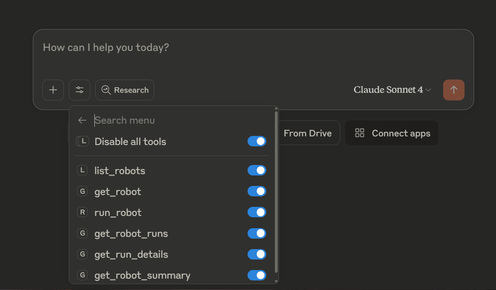

# Setup

Maxun MCP Server lets you connect any MCP-compatible AI client (Claude Desktop, Cursor, Windsurf, Cline, etc.) to your Maxun robots — so you can run extractions, check results, and manage robots through natural language.

There are two variants depending on how you use Maxun:

| | **Maxun Cloud** | **Self-Hosted (OSS)** |
|---|---|---|
| Setup | API key + URL only | Build step required |
| Auth | `x-api-key` header | Environment variable |
| Server URL | `https://app.maxun.dev/api/mcp` | Your local backend |

---

## Maxun Cloud

No build step needed. Connect directly to the cloud API with your Maxun API key.

### Prerequisites

- A Maxun Cloud account at [app.maxun.dev](https://app.maxun.dev)
- An MCP-compatible client (Claude Desktop, Cursor, Windsurf, Cline, etc.)

### 1. Generate your API Key

Go to your Maxun Dashboard and navigate to **Settings → API Key** to generate a key.

|
:---:|
|Generate API Key|

|
:---:|
|API Key Generated|

### 2. Configure your MCP client

Choose the configuration format that matches your client.

#### Native HTTP

```json
{
  "mcpServers": {
    "maxun": {
      "url": "https://app.maxun.dev/api/mcp",
      "headers": {
        "x-api-key": "your_api_key_here"
      }
    }
  }
}
```

#### Via mcp-remote (stdio bridge)

If your client does not support the `url` + `headers` format natively, use [`mcp-remote`](https://www.npmjs.com/package/mcp-remote) as a stdio-to-HTTP bridge — no separate install needed, `npx` handles it automatically.

```json
{
  "mcpServers": {
    "maxun": {
      "command": "npx",
      "args": [
        "-y",
        "mcp-remote",
        "https://app.maxun.dev/api/mcp",
        "--header",
        "x-api-key:your_api_key_here"
      ]
    }
  }
}
```

Most clients store this config as a JSON file. For example, in **Claude Desktop** it is at:
- **macOS:** `~/Library/Application Support/Claude/claude_desktop_config.json`
- **Windows:** `%APPDATA%\Claude\claude_desktop_config.json`

Check your client's documentation for the exact config file location.

### 3. Restart your client

After saving the config, restart the application. On success you will see the Maxun tools available in the client.



---

## Self-Hosted (OSS)

Use this if you are running the open-source Maxun instance locally or on your own server.

### Prerequisites

- Maxun OSS running locally (default: `http://localhost:8080`)
- Node.js installed

### 1. Build the MCP worker

Run the following command from the root of your Maxun project:

```bash
npm run mcp:build
```

This generates `dist/mcp-worker.js` in your project root.

### 2. Generate your API Key

Generate the API Key from your self-hosted Maxun Dashboard under **Settings → API Key**.

### 3. Configure your MCP client

Add the following to your client's MCP server config. For example, in Claude Desktop go to **File → Settings → Developer → Edit Config**:

```json
{
  "mcpServers": {
    "maxun": {
      "command": "node",
      "args": [
        "/path/to/your/project/dist/mcp-worker.js"
      ],
      "env": {
        "MCP_API_KEY": "your_api_key_here",
        "BACKEND_URL": "your_backend_url_here",
        "MCP_WORKER": "true"
      }
    }
  }
}
```

Replace `/path/to/your/project` with the absolute path to your Maxun project directory, and `your_backend_url_here` with your backend URL (e.g. `http://localhost:8080`).

After saving, restart your client. You'll see the Maxun tools available on successful configuration.
