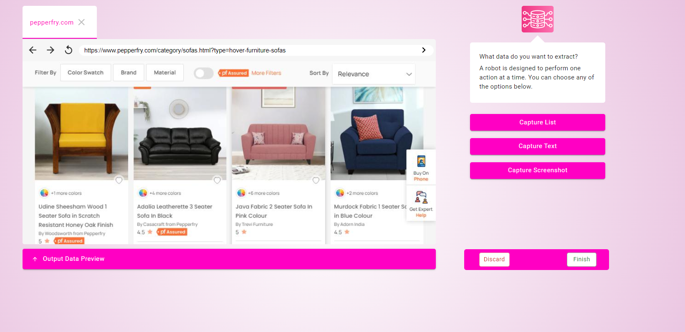

# Understanding Maxun Robots

Maxun robots are automated tools that help you collect data from websites without writing any code. Think of them as your personal web assistants that can navigate websites, extract information, and organize data just like you would manually - but faster and more efficiently.

## What Makes Maxun Robots Special?

When you browse a website and collect information manually, you typically perform actions like clicking, scrolling, and selecting text. Maxun robots automate these exact same actions. For example, if you want to collect product information from an e-commerce site, instead of copying and pasting each product's details, a Maxun robot can do this automatically while you focus on analyzing the collected data to make better business decisions.

## Available Capture Methods



Maxun Robots offer three specialized ways to collect data:

### Capture List
  Perfect for collecting structured data like our sofa example above. This method lets you:

  - Select a parent element containing all the information you want
  - Choose specific child elements within it
  - Configure pagination to collect data across multiple pages
  - Set limits on how many items to collect

### Capture Text
  Ideal for selecting specific text elements from a webpage. Use this when you need to:

  - Collect detailed product descriptions
  - Gather specifications
  - Save customer reviews
  - Extract specific text content

### Capture Screenshot
  Captures visual information from websites. You can:

  - Take full-page screenshots
  - Capture specific sections
  - Save visible portions of a page

## Core Concepts

Let's understand how Maxun robots work through a practical example of shopping for sofas on Pepperfry. Imagine you want to track sofa options, their prices, and ratings to make an informed purchase decision.

### Visual Selection System

When you browse Pepperfry's sofa collection, you see product cards containing various details - the manufacturer (like "By Casacraft from Pepperfry"), the sofa name (such as "Kaylee Velvet 2 Seater Sofa"), its price (₹43,999), and customer rating (5 stars). Maxun's point-and-click interface helps you select each of these elements with precision. As you hover over any detail, a pink highlight appears around it, showing exactly what information you'll capture.

### Smart Data Organization 

Think of how an interior designer might organize information about different sofas in a spreadsheet. They'd create columns for the manufacturer, model name, price, and ratings. Maxun works the same way - when you select elements on the page, you give each one a meaningful label.

Here's how your labeled data might look:
```javascript
{
  "item-0": [
    {
      "Sold By": "By Casacraft from Pepperfry",
      "Name": "Kaylee Velvet 2 Seater Sofa In Blush Pink Colour",
      "Price": "₹43,999",
      "Rating": "5"
    },
    {
      "Sold By": "By Febonic",
      "Name": "Daroo Velvet 2 Seater Sofa in Camel Beige Colour",
      "Price": "₹19,399",
      "Rating": "4.5"
    },
    {
      "Sold By": "By Fine Group",
      "Name": "Hardy Fabric 1 Seater Sofa In Navy Blue Colour",
      "Price": "₹15,189",
      "Rating": "4.5"
    },
  ]
}
```

### Advanced Pagination


When browsing websites, you often need to navigate through multiple pages to see all available items. Maxun Robots handle this automatically through:

1. Support for up to 5 different pagination methods

2. Automatic handling of:
    - "Click next" buttons
    - "Load More" buttons
    - Infinite scrolling
    - URL-based navigation
    - No more items 

3. Customizable collection limits to focus on relevant data