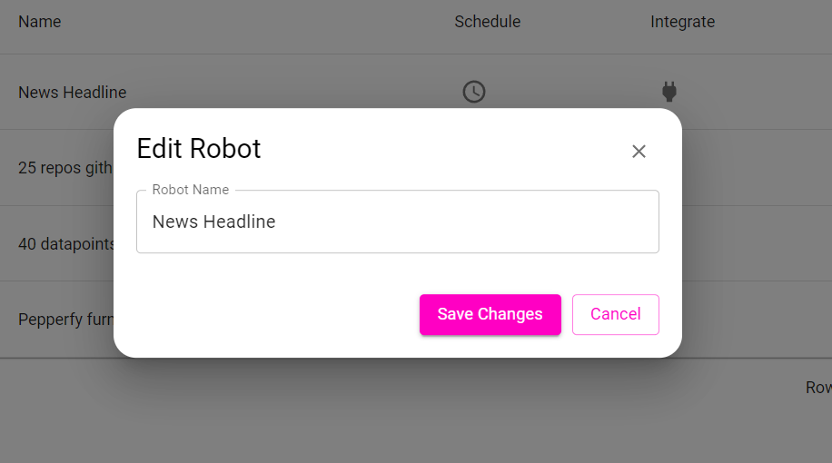
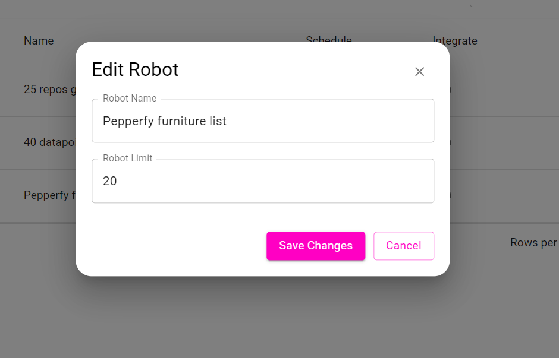
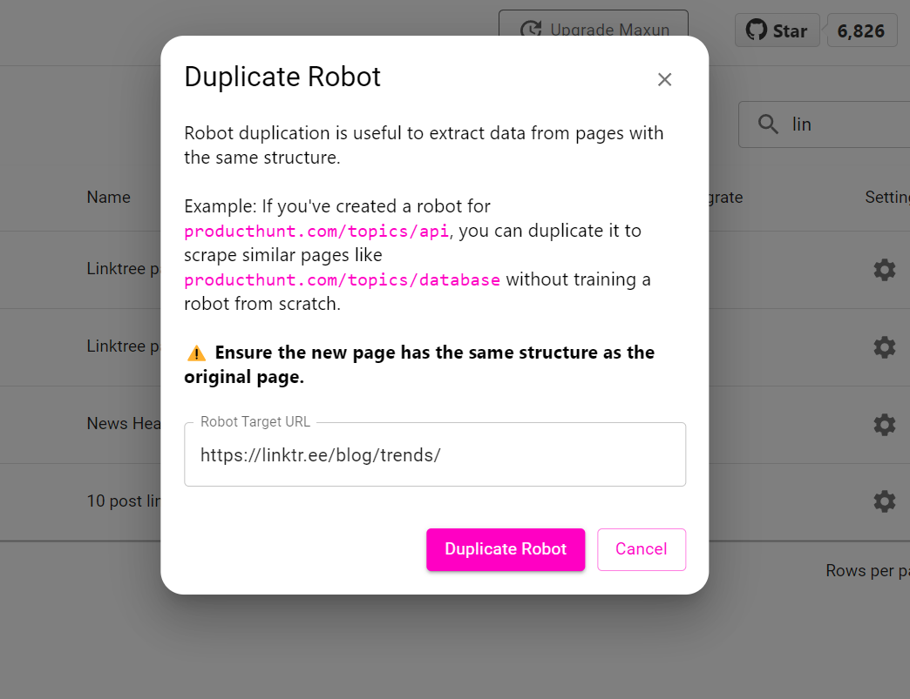

## 1. Edit

An existing robot's name or limit can be changed. Limits are available only for robots performing Capture List action.

|||
|:---:|:---:|
|Capture Text Or Capture Screenshot Robot |Capture List Robot|

## 2. Delete

An existing robot can be deleted only **if the robot does not have any associated runs**. For example, if a robot has been run 5 times in total, then these 5 runs would need to be deleted in order to delete the robot.

## 3. Duplicate 

A robot can be duplicated to extract data from pages **having the same structure**. Using duplication, a new robot need not be trained from scratch.

