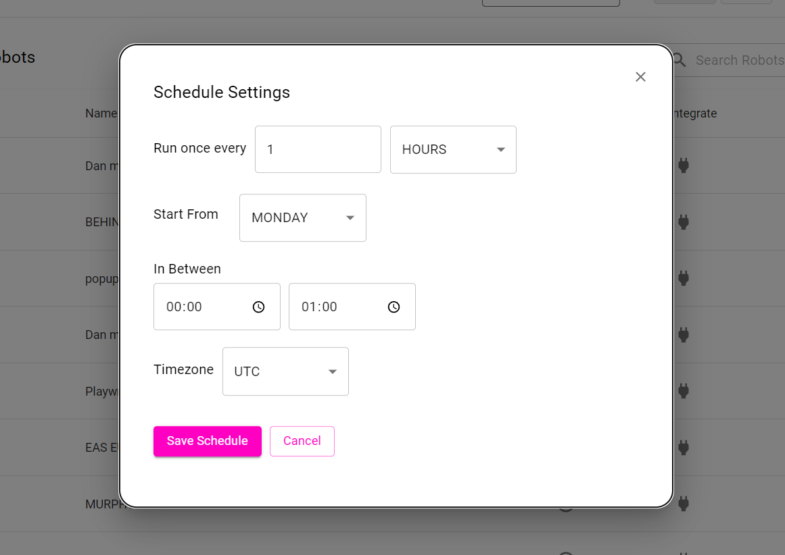

Robots can be scheduled to run at specific time intervals. Scheduling can be configured as shown below:

### 1. Run once every

A robot can be scheduled to run once every provided time duration:

- Minutes
- Hours 
- Days
- Weeks 
- Months

### 2. Start from

A robot can be scheduled to start at any day of the week.

### 3. In Between 

A robot can be scheduled to run between a specified time interval.

### 4. Timezone 

A robot can be scheduled to run across different timezones.

Once the robot has been scheduled it will run successfully at the specified time. The user has the option to delete the schedule if required.

