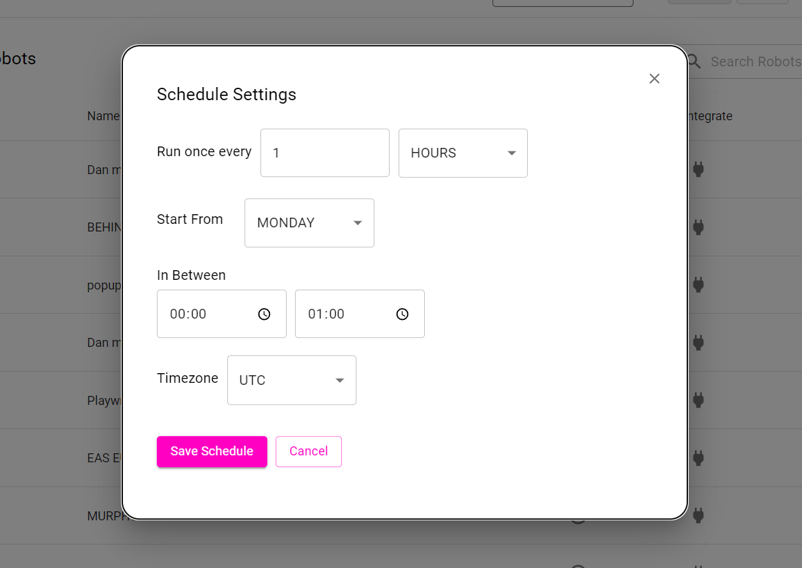
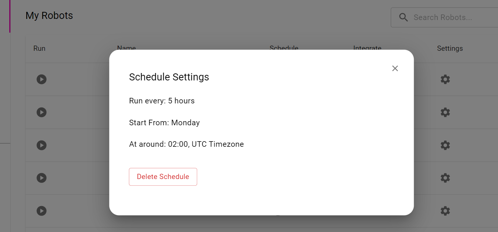

import Tabs from '@theme/Tabs';
import TabItem from '@theme/TabItem';

# Schedule

Robots can be scheduled to run automatically at specific time intervals, so your data stays fresh without manual runs. In the dashboard, scheduling is configured in the robot's settings:



## 1. Run once every

A robot can be scheduled to run once every provided time duration:

- Minutes
- Hours 
- Days
- Weeks 
- Months

## 2. Start from

A robot can be scheduled to start at any day of the week.

## 3. In Between

A robot can be scheduled to run between a specified time interval.

## 4. Timezone

A robot can be scheduled to run across different timezones.



Once the robot has been scheduled it will run successfully at the specified time. You can delete the schedule at any time.

## Schedule With the SDK

<Tabs>
  <TabItem value="node" label="Node.js">

```javascript
// Every day at 9:00 in Kolkata time
await robot.schedule({ runEvery: 1, runEveryUnit: 'DAYS', atTimeStart: '09:00', timezone: 'Asia/Kolkata' });
```

  </TabItem>
  <TabItem value="python" label="Python">

```python
# Every day at 9:00 in Kolkata time
await robot.schedule(run_every=1, run_every_unit="DAYS", at_time_start="09:00", timezone="Asia/Kolkata")
```

  </TabItem>
</Tabs>

See [Node.js Robot Management](/sdk/node-sdk/sdk-robot) and [Python Robot Management](/sdk/python-sdk/sdk-robot) for all scheduling options.

## Schedule + Monitoring

Combine a schedule with [Monitoring](/monitoring) to get notified when a website changes, for example to track competitor prices daily.


