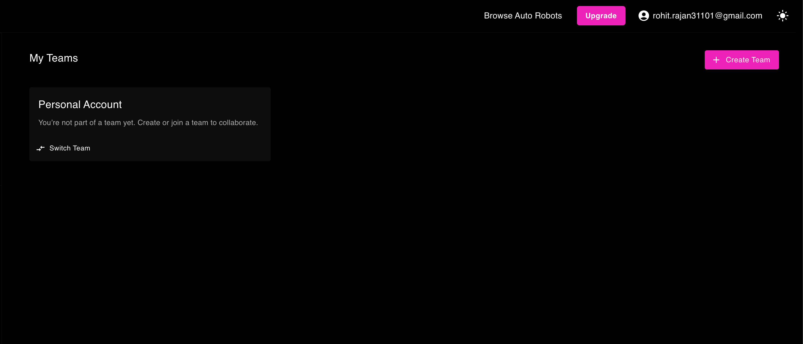
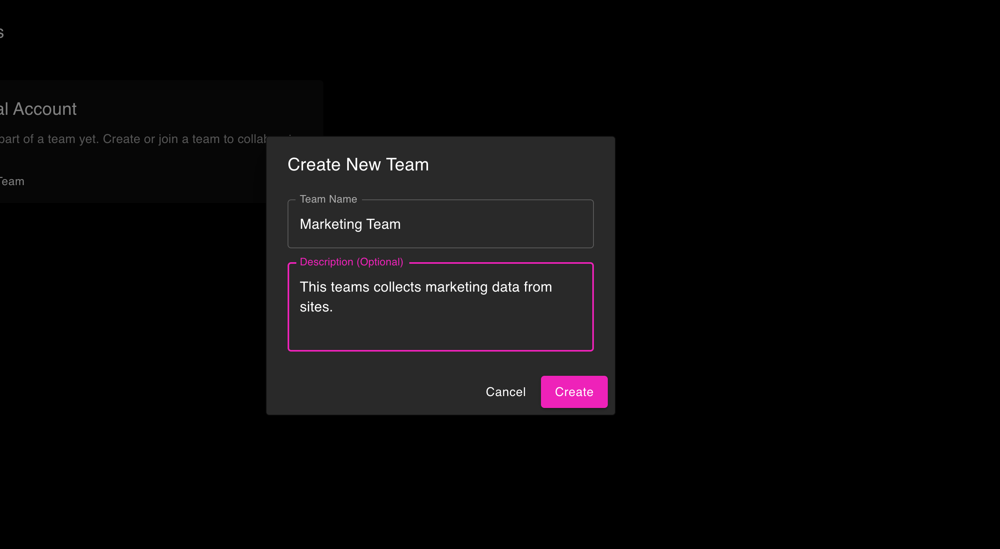
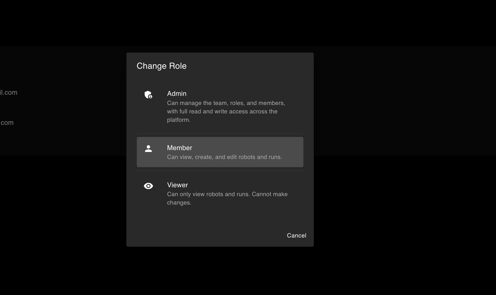
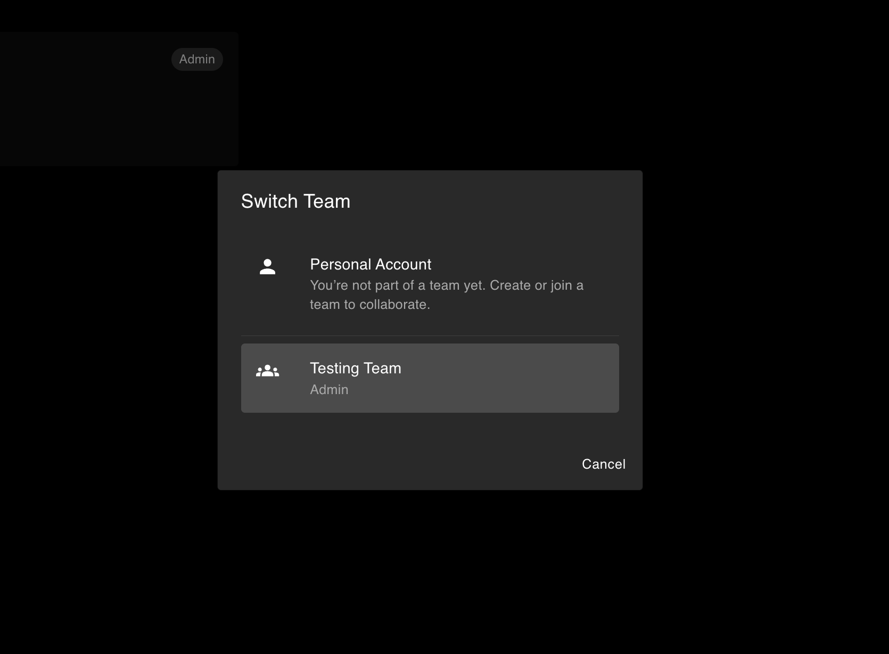

Maxun Cloud allows you to collaborate effectively by sharing robots, runs, and settings across multiple accounts using **Teams**. 

Teams provide a unified workspace where members can build, test, and extract data together securely, all without having to share personal account credentials.

---

## Setting up a Team

You can quickly create a team within the Maxun Dashboard.

1. Navigate to the **My Teams** panel from your user account dropdown.
2. Click **Create Team**.
3. Give your team a descriptive name (e.g., "Marketing Team") and an optional description.

> **Note:** Team creation limits are tied to your subscription plan. Users on free or trial tiers may be restricted to their Personal Account and must upgrade to unlock collaborative features. Users are allowed to create 1 team per account.

---

## Team Seat Limits 

The number of members you can invite is determined by the **Team Owner’s Subscription Plan**. 

When a user is invited to a team, the system automatically checks the team owner's plan to evaluate available seats. 

A user seat is considered active if:
- A user has successfully joined the team.
- There is a **Pending Invitation** for a user that has not yet expired.

If the owner's subscription requires renewal or the member limit is exceeded, the associated team will temporarily become paused until the plan is updated or members are removed. 

---

## Roles and Permissions

Maxun provides access control through three specific roles to keep your data secure.

### Admin
- **Full Control**: Create, read, update, and delete resources.
- **Team Management**: Invite new users, remove existing members, and modify member roles.
- **Configurations**: Manage advanced settings and configure API Keys.

### Member
- **Standard Access**: Create, read, and update resources (like building and executing robots).
- **Restrictions**: Cannot delete resources, invite/remove users, or manage API Keys.

### Viewer
- **Read-Only**: View existing resources, robot configurations, and extracted data.
- **Restrictions**: Cannot create, modify, execute, or delete any resources or settings.

---

## Inviting Members

Admins can easily invite new users to their workspace directly from the dashboard:

1. Inside your team view, click **Invite Member**.
2. Enter the email address of the new user and assign them an appropriate role (`Admin`, `Member`, or `Viewer`).
3. The user will instantly receive an email containing a secure invitation link valid for 7 days.

---

## Switching Contexts (Personal Account vs Teams)

You are never strictly locked into a single workspace. 

By using the **Switch Team** button on your Team configurations page, you can dynamically transition between your private **Personal Account** and any **Teams** you belong to. 

* When in your **Personal Account**, all robots, runs, and data reside securely and privately under your individual account limits.
* When toggled into a **Team Context**, all building, extractions, and API logs will automatically execute and associate directly with that Team, tracking against the team owner's unified account.

